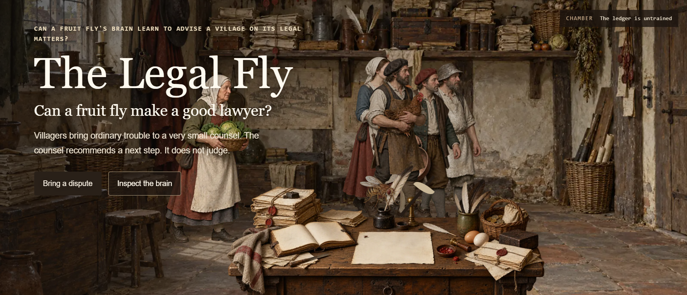

# The Legal Fly

> **Can a fruit fly be a good lawyer?**

The Legal Fly is an experiment that tests whether the real neural connectome of a fruit fly can make simple legal recommendations.

[](https://legalfly-web.onrender.com/)
[](https://github.com/zgbrenner/thelegalfly)
[](LICENSE)

<p align="left">
  
</p>

---

## What is this?

A villager walks into a tiny early-modern law office:

> "My neighbor's goat keeps eating my cabbages."

Instead of sending that dispute directly to a conventional AI model, The Legal Fly converts it into structured facts, stimulates sensory neurons inside a reconstruction of the **male fruit fly brain and central nervous system**, propagates activity through the biological connectome, and reads the resulting neural state to decide what the village lawyer should recommend.

The lawyer is a fly.

The nervous system is real.

The legal system is fictional.

---

## The Experiment

```text
GOAT EATS CABBAGES
        ↓
structured facts
        ↓
sensory neuron stimulation
        ↓
REAL FRUIT FLY CONNECTOME
        ↓
neural activity propagates
        ↓
motor / descending neurons
        ↓
"Seek restitution."
```

The core question is deliberately strange:

> **Can the structure of a biological nervous system be repurposed as a computational substrate for a task it never evolved to perform?**

Fruit flies did not evolve to interpret contracts, weigh evidence, or resolve property disputes.

So naturally, we made one a lawyer.

---

## The Fly Brain Is Not Decorative

The simulation uses the **Janelia FlyEM MaleCNS v1.0 connectome**.

| Metric                                 |           Count |
| -------------------------------------- | --------------: |
| Traced neuronal bodies                 |     **165,122** |
| Directed neuron-pair connections       |  **25,563,197** |
| Synaptic contacts                      | **124,025,046** |
| Neurons with released soma coordinates |     **140,024** |

The interface visualizes real released neuron positions inside the fly.

When neurons light up, those values correspond to actual nodes used by the simulation.

This is not a random glowing-brain animation pasted on top of a classifier.

---

## How It Works

```text
Petition
   ↓
MiniMind / Manual Input
   ↓
8 confirmed fact dimensions
   ↓
15,897 sensory neurons
   ↓
MaleCNS connectome
   ↓
neural propagation
   ↓
256 motor / descending features
   ↓
trained readout
   ↓
8 recommendations
or
ABSTAIN
```

The eight fact dimensions are:

* matter
* property
* harm
* proof
* intent
* relationship
* urgency
* ability

Only confirmed facts reach the fly.

The language model does not get to secretly choose the answer.

---

## Give the Fly Language

The fruit fly connectome does not understand English.

For that, The Legal Fly uses **MiniMind**, a small language model that runs inside your browser and can translate a villager's petition into structured facts.

MiniMind can:

* extract candidate facts
* translate natural language into the eight input dimensions
* pick the wording of the fly's recommendation from a fixed set of authored notes

MiniMind cannot:

* override the fly's selected action
* receive the correct legal answer during active inference
* replace the connectome
* send your petition off your device

### MiniMind in the Browser

MiniMind runs **directly in your browser**. There is no Python to install, no local server to start, and no API key.

```text
Petition
   ↓
MiniMind in your browser
   ↓
confirmed structured facts
   ↓
fruit fly nervous system
```

Select **Enable MiniMind** on the petition panel. The browser downloads the model once, checks every file against its SHA-256 hash, and keeps the verified copy in the browser's own cache for later visits. Nothing is fetched until you ask.

| Item | Value |
| --- | --- |
| One-time download | about 252 MB (240 MiB) in five files from the same origin as the page; exact sizes and hashes are in the served `/minimind/manifest.json` |
| Tokenizer | Transformers.js 3.8.1 |
| Inference | ONNX Runtime Web 1.30.0 in a Web Worker; WebGPU when the browser exposes it, otherwise WASM |
| Parameters | 63.9M, all frozen |
| Verified in | headless Chromium on the WASM path |
| Not certified | the WebGPU path, Firefox, Safari |

Your petition goes from the page to a Web Worker on the same origin and nowhere else. If the browser cannot run MiniMind, the page says so and you fill in the eight facts yourself. Manual facts work in every state.

The Python adapter in `apps/minimind_adapter/` is kept only as the conversion and parity reference for the browser bundle. It is not part of the hosted site.

See `docs/MINIMIND_SETUP.md` for cache behavior, troubleshooting, and how to build the bundle yourself.

---

## So... Is the Fly Actually Good at Law?

Current held-out results:

| System                  |       Exact |
| ----------------------- | ----------: |
| Biological MaleCNS      | **13 / 16** |
| Shuffled connectome     |     11 / 16 |
| Facts-only centroid     | **14 / 16** |
| Frozen MiniMind readout |      7 / 16 (6 / 16 in the browser, one knife-edge case) |
| Fictional charter rules |      9 / 16 |

So no, this repository does **not** prove that fruit flies secretly understand law.

The simple facts-only baseline currently performs better.

That matters.

The point is not to manufacture a flashy benchmark. The point is to ask whether the organization of a biological nervous system contributes anything measurable when the inputs, task, training examples, and evaluation are controlled.

---

## The Village Lawyer

The experiment lives inside a fictional early-modern village law office inspired by old European legal paintings.

Villagers bring disputes.

The fly listens.

Its nervous system activates.

Then it gives counsel under a tiny fictional village charter.

**The aesthetic is ridiculous. The computation is not.**

---

## Try It

### Live demo

[Open The Legal Fly](https://legalfly-web.onrender.com/)

[](https://legalfly-web.onrender.com/)

### Run locally

```bash
git clone https://github.com/zgbrenner/thelegalfly.git
cd thelegalfly/apps/web

npm ci
npm run dev
```

Then open:

```text
http://localhost:3000
```

---

## Prepare the Brain

```bash
python -m pip install pyarrow pandas numpy

python tools/prepare_malecns.py \
  --download \
  --convert \
  --export-browser
```

Then restart the web app.

The application intentionally refuses to silently replace the MaleCNS dataset with an older subset or synthetic graph.

---

## Prepare MiniMind (optional)

Without the bundle the app still runs. The MiniMind card appears, and **Enable MiniMind** fails with a plain message instead of pretending.

To build the real browser bundle locally:

```bash
python -m pip install --require-hashes --only-binary=:all: \
  -r tools/requirements/minimind-browser.txt

python tools/prepare_minimind_browser.py \
  --download \
  --convert \
  --quantization q8 \
  --export-web
```

The hash-locked requirements target CPython 3.12 on Linux x86_64. On other platforms use `python -m pip install -e '.[browser]'` instead.

The bundle lands in `apps/web/public/minimind/`, which git ignores. Restart the web app afterwards.

---

## Architecture

```text
┌─────────────────────┐
│  Villager Petition  │
└──────────┬──────────┘
           ↓
┌─────────────────────┐
│      MiniMind       │
│   in your browser   │
└──────────┬──────────┘
           ↓
┌─────────────────────┐
│ Confirmed Fact Vec. │
└──────────┬──────────┘
           ↓
┌─────────────────────┐
│ Sensory Stimulation │
└──────────┬──────────┘
           ↓
┌─────────────────────┐
│ MaleCNS Connectome  │
│   165k+ neurons     │
└──────────┬──────────┘
           ↓
┌─────────────────────┐
│   Neural Readout    │
└──────────┬──────────┘
           ↓
┌─────────────────────┐
│ Legal Recommendation│
└─────────────────────┘
```

---

## Privacy

The project is designed around **local-first computation**.

Connectome inference, training, model inspection, benchmarks, and visualization run locally.

Optional language processing uses MiniMind inside your own browser rather than a hosted general-purpose LLM. Petition text is never sent to a server, placed in a URL, logged, or stored; it travels only from the page to a same-origin Web Worker. The hosting provider still sees ordinary static-asset requests and IP addresses.

No API key is required to ask a fly about your fictional goat dispute.

See `docs/PRIVACY.md`.

---

## Reproducibility

The project pins its source data and model revisions so the experiment can be reproduced rather than hand-waved.

See:

* `docs/METHOD.md`
* `docs/VERIFICATION.md`
* `docs/MINIMIND_SETUP.md`

The repository includes checks for:

* edge direction
* deterministic encoding
* label leakage
* abstention behavior
* anatomy provenance
* shuffled-graph controls
* correction safety
* model validation

---

## Data

Connectome:

**Janelia FlyEM MaleCNS v1.0**

Dataset license:

**CC BY 4.0**

The Legal Fly source code itself is released under the **MIT License**.

---

## Contributing

Experiments, controls, visualization improvements, browser inference work, and scientifically defensible weird ideas are welcome.

```bash
git clone https://github.com/zgbrenner/thelegalfly.git
```

Open an issue or submit a pull request.

If you manage to make the fly a materially better lawyer, evidence is preferred.

---

## License

The Legal Fly is open source under the **MIT License**.

See [`LICENSE`](LICENSE).

Connectome data retains its original **CC BY 4.0** licensing and attribution requirements.

---

## Disclaimer

The Legal Fly is an experimental computational neuroscience and software project.

It is not:

* legal advice
* a legal reasoning system
* evidence that fruit flies understand law
* proof that biological connectomes outperform machine learning
* a replacement for an attorney
* a tiny member of the bar trapped inside your browser

At least not yet.

---

## The Question

Most AI projects ask:

> **How much intelligence can we build?**

The Legal Fly asks something stranger:

> **How much computation is already hiding inside a brain built for something else?**

And, critically:

> **Can it handle the goat case?**

[](https://legalfly-web.onrender.com/)
[](https://github.com/zgbrenner/thelegalfly)
